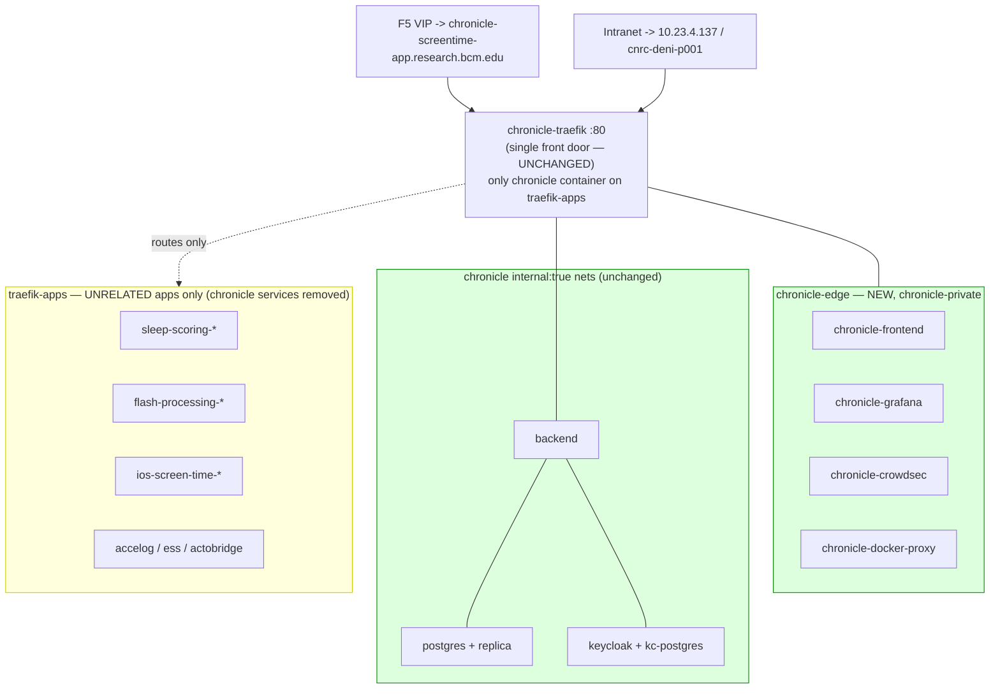

# Host Docker Network Topology & Isolation Plan

**Host:** `10.23.4.137` (`cnrc-deni-p001.cnrc.bcm.edu`) — single Docker daemon.
**Front door:** `chronicle-traefik`, published on `10.23.4.137:80`. It is the **only**
network-reachable reverse proxy on this host and fronts *every* project via two planes
(see Routing Planes below).

> Status: **network-only isolation APPLIED 2026-06-02** and verified end-to-end (see §3).
> §1–§2 describe the *prior* flat-bridge state; §3 is what is now live.

---

## 1. Current state (as discovered)

### 1.1 Network inventory

| Network | Subnet | `internal` | Role | State |
|---|---|---|---|---|
| `traefik-apps` | 172.25.0.0/16 | **false** | **Flat shared ingress bridge** — 18 containers, 7 projects | ⚠️ over-shared |
| `chronicle_chronicle-internal` | 172.30.0.0/16 | true | Chronicle data plane (db, backend, monitoring) | ✅ |
| `chronicle-backend-bridge` | 172.29.0.0/16 | true | traefik ↔ backend choke point (WAF-bypass guard) | ✅ |
| `chronicle-sso-edge` | 192.168.0.0/20 | true | traefik ↔ keycloak | ✅ |
| `chronicle-sso-broker` | 192.168.16.0/20 | true | backend ↔ keycloak | ✅ |
| `chronicle-sso-db` | 172.31.0.0/16 | true | keycloak ↔ keycloak-postgres | ✅ |
| `sleep-scoring-network` | 172.21.0.0/16 | false | sleep-scoring private net | sibling-owned |
| `flash-processing-internal` | 172.22.0.0/16 | false | flash-processing private net | sibling-owned |
| `ios-screen-time_default` | 172.26.0.0/16 | false | ios-screen-time dev net | sibling-owned |
| `ios-screen-time-…-wasm-network` | 192.168.32.0/20 | false | ios wasm net | sibling-owned |
| `research-pipeline_pipeline-network` | 172.18.0.0/16 | false | has live `research-pipeline-postgres` | **NOT empty** |
| `chronicle_chronicle-backend-bridge` | 172.28.0.0/16 | true | **stale dup** of `chronicle-backend-bridge` | 🗑️ empty |
| `traefik-local` | 172.23.0.0/16 | false | **intended 2nd net of the `/home/opt/traefik` gateway** (see §3) | keep |
| `wearsync-dev-network` | 172.20.0.0/16 | false | orphaned | 🗑️ empty |
| `polar-sdk-app-test_default` | 172.19.0.0/16 | false | orphaned | 🗑️ empty |
| `server_default` | 172.27.0.0/16 | false | orphaned | 🗑️ empty |
| `dokploy-network` | 10.0.1.0/24 (overlay) | false | swarm artifact | 🗑️ empty |
| `ingress`, `docker_gwbridge` | swarm system | — | swarm enabled but ~unused | (system) |
| `bridge`, `host`, `none` | default | — | docker defaults | (system) |

### 1.2 Routing planes (one proxy, two faces)

`chronicle-traefik` serves two distinct router sets off the same `:80` entrypoint:

| Plane | Matched on | Provider | Gate | Exposes |
|---|---|---|---|---|
| **Public (F5)** | `Host(chronicle-screentime-app.research.bcm.edu)` (→ F5 VIP 10.64.76.105 → 10.23.4.137:80), `tls=true` (forwarded-https) | docker labels | **CrowdSec WAF** + rate-limit + headers | **Chronicle only** — mobile API `/chronicle/v3,v4`, web API `/chronicle/api/web`, SPA `/chronicle`, `/` |
| **Intranet** | `Host(10.23.4.137)` \|\| `Host(cnrc-deni-p001[.cnrc.bcm.edu])` | file (`local-apps.yml`) | **`local-only`** (RFC1918 IP allowlist) + stripPrefix | **Whole campus suite** — `/chronicle`, `/grafana`, `/sleep-scoring(/api)`, `/wasm-ss`, `/flash(/api,/ws)`, `/temporal`, `/minio`, `/accelerometer-tracking`, `/ess`, `/actobridge` |

`sleep-scoring-traefik` binds **`127.0.0.1:80` + `127.0.0.1:8088` only** (loopback). It is not
network-reachable and every sleep-scoring service it could front is *already* fronted by
chronicle-traefik via `local-apps.yml`. → **Redundant / legacy.**

### 1.3 Topology diagram (current)

```mermaid
flowchart TB
    F5["F5 VIP 10.64.76.105<br/>chronicle-screentime-app.research.bcm.edu"]
    LAN["Intranet clients<br/>(10.x / cnrc-deni-p001)"]

    F5 -->|":443 → :80 XFF-https"| TR
    LAN -->|":80"| TR

    subgraph APPS["🔴 traefik-apps — FLAT shared bridge (172.25/16, internet-capable, NOT internal)"]
        direction LR
        TR["chronicle-traefik<br/>:80 FRONT DOOR"]
        CS["chronicle-crowdsec"]
        DP["chronicle-docker-proxy"]
        CFE["chronicle-frontend ⚠️"]
        CGF["chronicle-grafana ⚠️"]
        SST["sleep-scoring-traefik<br/>(loopback-only, redundant)"]
        SSB["sleep-scoring-backend"]
        SSF["sleep-scoring-frontend"]
        SSW["sleep-scoring-frontend-wasm"]
        FPB["flash-processing-backend"]
        FPF["flash-processing-frontend"]
        IOS["ios-screen-time ×4"]
        ACC["accelogtracker-dashboard"]
        ESS["ess-scoring-upload-server"]
        ACT["actobridge-upload-server"]
    end

    subgraph CINT["🟢 chronicle_chronicle-internal (internal:true)"]
        PG["chronicle-postgres + replica"]
        BE["chronicle-backend"]
        VM["victoria-metrics / -logs / fluent-bit"]
        CFE2["chronicle-frontend"]
        CGF2["chronicle-grafana"]
    end

    subgraph SSO["🟢 chronicle SSO + backend bridges (internal:true)"]
        BB["chronicle-backend-bridge: traefik↔backend"]
        SE["chronicle-sso-edge: traefik↔keycloak"]
        SBK["chronicle-sso-broker: backend↔keycloak"]
        SDB["chronicle-sso-db: keycloak↔kc-postgres"]
    end

    subgraph SIB["🟡 sibling private nets (own internal-ish nets, also on traefik-apps)"]
        SSN["sleep-scoring-network"]
        FPN["flash-processing-internal"]
        IOSN["ios-screen-time_default / wasm"]
    end

    subgraph DEAD["🗑️ empty / stale (prune candidates)"]
        D1["chronicle_chronicle-backend-bridge (stale dup)"]
        D2["traefik-local"]
        D3["wearsync-dev-network"]
        D4["polar-sdk-app-test_default"]
        D5["server_default"]
        D6["dokploy-network (swarm)"]
    end

    TR --- BB
    TR --- SE
    BE --- BB

    classDef bad fill:#fdd,stroke:#c00,stroke-width:2px;
    classDef good fill:#dfd,stroke:#080;
    classDef warn fill:#ffd,stroke:#cc0;
    classDef dead fill:#eee,stroke:#999,color:#777;
    class APPS bad;
    class CINT,SSO good;
    class SIB warn;
    class DEAD dead;
```

---

## 2. Findings

1. **Flat shared L2 is the core defect.** `traefik-apps` is a non-`internal` bridge holding
   18 containers from 7 unrelated projects. Any container on it can reach any other **by IP
   directly**, bypassing chronicle-traefik (and therefore bypassing `local-only`, CrowdSec
   WAF, stripPrefix, and rate-limiting).

2. **Chronicle's SPA + Grafana are the exposed surface — *not* PHI.** `chronicle-frontend:8080`
   and `chronicle-grafana:3000` are multi-homed onto `traefik-apps`, so ~14 sibling containers
   can hit them by IP. The **backend (`:40320`) and Postgres/PHI are safe** — they live only on
   `internal:true` nets and are *not* on `traefik-apps`.

3. **A real control contradiction.** The compose comment says Grafana is file-provider-routed
   "to enforce internal-only access without XFF spoofing risk," and the route *is* gated by
   `local-only`. But at the **network layer** `chronicle-grafana:3000` sits on a shared bridge
   reachable by every sibling by IP — which **bypasses `local-only` entirely**. The routing
   control is sound; the network adjacency undercuts it.

4. **Redundant proxy.** `sleep-scoring-traefik` is loopback-only and superseded by
   chronicle-traefik's `local-apps.yml` routes. Candidate for retirement.

5. **Stale/empty networks.** `chronicle_chronicle-backend-bridge` (stale dup — superseded once
   `name: chronicle-backend-bridge` was pinned), plus `wearsync-dev-network`,
   `polar-sdk-app-test_default`, `server_default`, `dokploy-network`. All empty.
   `research-pipeline_pipeline-network` is **NOT** a prune candidate (live postgres attached),
   and `traefik-local` is **NOT** junk — it is the intended 2nd net of the `/home/opt/traefik`
   gateway (§3). Each empty net must be grep-checked for `external: true` references in other
   compose files before removal.

6. **A neutral host gateway was already scaffolded but never came up.**
   `/home/opt/traefik/docker-compose.yml` defines `container_name: traefik` (docker provider,
   on `traefik-apps` + `traefik-local`) — exactly the separate front door this refactor needs.
   It tries to bind `80:80`, which collides with chronicle-traefik's `10.23.4.137:80`, so it
   never started; chronicle-traefik squatted the role and absorbed every project's routes via
   `local-apps.yml`. **The refactor finishes this gateway rather than building a new one.**

---

## 3. Implemented architecture — network-only isolation (APPLIED 2026-06-02)

**One front door, unchanged. Only the docker networks were re-wired.** No second proxy, no new
IP, no F5 change, no port change, no URL change. `chronicle-traefik` keeps `10.23.4.137:80` and
still fronts both chronicle (via the F5) and the unrelated intranet apps (via `local-apps.yml`).
Isolation is purely at the network layer.

### What changed
- **New `chronicle-edge` bridge** (`name: chronicle-edge`). Chronicle's own edge/infra services —
  `chronicle-frontend`, `chronicle-grafana`, `chronicle-crowdsec`, `chronicle-docker-proxy` —
  moved **off** the shared `traefik-apps` bridge **onto** `chronicle-edge`.
- **`chronicle-traefik` is dual-homed:** stays on `traefik-apps` (to route the apps) **and** joins
  `chronicle-edge` (to reach chronicle's services). It is now the **only** chronicle container on
  `traefik-apps` — the single controlled choke point.
- The two `traefik.docker.network` labels (frontend, grafana) flipped `traefik-apps` →
  `chronicle-edge`. Backend/SSO routers use explicit per-net labels and were untouched.

### What did NOT change
chronicle-traefik endpoint `10.23.4.137:80`, the F5, every app URL, all chronicle URLs (F5 +
intranet), and chronicle's `internal:true` nets (`chronicle_chronicle-internal`,
`chronicle-backend-bridge`, `chronicle-sso-*`).

### Result
- **Isolation achieved:** sibling app containers can no longer resolve or reach
  `chronicle-frontend`, `chronicle-grafana`, or `chronicle-docker-proxy` (the docker-socket proxy
  — the biggest prior exposure). chronicle-backend + Postgres/PHI were already isolated.
- **Finding 3 fixed:** Grafana/SPA are reachable only through chronicle-traefik; the flat-bridge
  IP bypass is gone.

### Verification (2026-06-02, post-apply)
- **Real F5:** `/chronicle/` → 200 (`chronicle-frontend-pub@docker`, the moved frontend reached
  over `chronicle-edge`), `/` → 302, `/chronicle/v3/healthz` → 401 (`chronicle-mobile`),
  `/chronicle/api/web/studies` → 401 (`chronicle-web`).
- **Intranet:** `/chronicle` → 200, `/grafana/api/health` → 200; apps `/sleep-scoring` 200,
  `/flash` 200, `/accelerometer-tracking` 303.
- **Negative (isolation proof):** `chronicle-docker-proxy` / `chronicle-frontend` /
  `chronicle-grafana` unresolvable from `sleep-scoring-backend`. Zero Traefik errors.

### Implemented diagram
See `docs/network-target.png`.

### Not done (deferred — separate, larger change)
The full **two-proxy split** (a neutral `/home/opt/traefik` gateway owning the apps, chronicle on
its own IP) was considered and **set aside**: it needs a new IP + an F5 repoint and changes
endpoints, which this network-only isolation deliberately avoids. The apps' routes still live in
chronicle's `local-apps.yml` and are still served by chronicle-traefik. Revisit only if full
proxy/ownership separation becomes a requirement.

### Remaining cleanup (optional, not yet done)
- Prune the empty/stale nets: `chronicle_chronicle-backend-bridge`, `wearsync-dev-network`,
  `polar-sdk-app-test_default`, `server_default`, `dokploy-network` (grep sibling compose for
  `external` refs first). Keep `traefik-local`, `research-pipeline_pipeline-network`.
- Retire loopback-only `sleep-scoring-traefik`.
